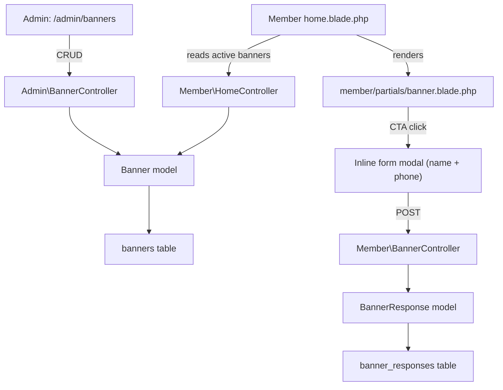

# Banner Section Feature

## Architecture

## Database

### `banners` table (new migration)

- `id` (PK)
- `title` (string, required) -- English title
- `title_am` (string, nullable) -- Amharic title
- `description` (text, nullable) -- English description
- `description_am` (text, nullable) -- Amharic description
- `image` (string, nullable) -- stored via `Storage::disk('public')`, same pattern as announcements
- `button_label` (string, default: "I'm Interested")
- `button_label_am` (string, nullable)
- `button_url` (string, nullable) -- external URL; if null, the default form modal opens
- `is_active` (boolean, default: false)
- `sort_order` (unsignedSmallInteger, default: 0)
- `timestamps`

### `banner_responses` table (new migration)

- `id` (PK)
- `banner_id` (FK -> banners)
- `member_id` (FK -> members)
- `contact_name` (string)
- `contact_phone` (string, 50)
- `timestamps`
- Unique constraint: `[banner_id, member_id]`

## Files to Create

- `database/migrations/2026_02_28_..._create_banners_table.php`
- `database/migrations/2026_02_28_..._create_banner_responses_table.php`
- `app/Models/Banner.php` -- fillable, casts, `localizedTitle()`, `localizedDescription()`, `imageUrl()`, `localizedButtonLabel()`, `scopeActive()`, `responses()` relationship
- `app/Models/BannerResponse.php` -- fillable, relationships
- `app/Http/Controllers/Admin/BannerController.php` -- `index()`, `store()`, `update()`, `destroy()`, `toggleActive()`, response stats display
- `app/Http/Controllers/Member/BannerController.php` -- `respond()` endpoint (POST, collects name + phone)
- `resources/views/admin/banners/index.blade.php` -- admin CRUD form + response list (same pattern as [admin/fundraising/index.blade.php](resources/views/admin/fundraising/index.blade.php))
- `resources/views/member/partials/banner.blade.php` -- responsive banner card with optional image, text, CTA button, and inline form modal

## Files to Modify

- [routes/web.php](routes/web.php) -- add admin banner routes + member banner response route
- [resources/views/layouts/admin.blade.php](resources/views/layouts/admin.blade.php) -- add "Banners" sidebar link (super_admin only, same as fundraising)
- [app/Http/Controllers/Member/HomeController.php](app/Http/Controllers/Member/HomeController.php) -- query active banners and pass to view
- [resources/views/member/home.blade.php](resources/views/member/home.blade.php) -- include banner partial after the announcements section (line ~305)
- [lang/en/app.php](lang/en/app.php) -- add ~20 new translation keys for banner UI
- [lang/am/app.php](lang/am/app.php) -- add corresponding Amharic translations
- [database/seeders/TranslationSeeder.php](database/seeders/TranslationSeeder.php) -- register new `banners` group
- [app/Http/Controllers/Admin/TranslationController.php](app/Http/Controllers/Admin/TranslationController.php) -- register `banners` group under the `user` section

## Member-Facing Banner Design

- Rendered below the announcements section on the home page
- Responsive card: if image is present, it fills the top with `object-cover` and `aspect-[16/9]`; if no image, the card is text-only
- Title, description, and CTA button all use `localizedX()` helpers for EN/AM
- Follows light/dark theme using existing Tailwind CSS variables (`bg-card`, `text-primary`, `border-border`, etc.)
- Default CTA button opens an inline Alpine.js form modal (same UX as the fundraising popup form) collecting name and phone
- If `button_url` is set, the button links externally instead of opening the form
- Multiple banners can be active; they render in `sort_order` sequence

## Admin Banner Page

- Single page at `/admin/banners` with create/edit form at top and list of existing banners below
- Form fields: title (EN), title (AM), description (EN), description (AM), image upload, button label (EN), button label (AM), button URL (optional), active toggle, sort order
- Below the form: table of responses (name, phone, date) with a count badge -- same pattern as fundraising responses
- Image upload uses `Storage::disk('public')` with `banners/` prefix, same as announcements

## Translation Keys

All under a new `banners` group, registered in both TranslationSeeder and TranslationController:

- `banner_section_title` -- section heading on home page
- `banner_interested` -- default CTA button text
- `banner_form_title` -- form modal heading
- `banner_form_desc` -- form modal description
- `banner_name_placeholder`, `banner_phone_placeholder`
- `banner_name_required`, `banner_phone_required`
- `banner_submit`, `banner_thankyou_title`, `banner_thankyou_desc`
- Admin keys: `banner_admin_title`, `banner_admin_create`, `banner_admin_edit`, `banner_admin_delete_confirm`, `banner_admin_saved`, `banner_admin_deleted`, `banner_admin_responses`
